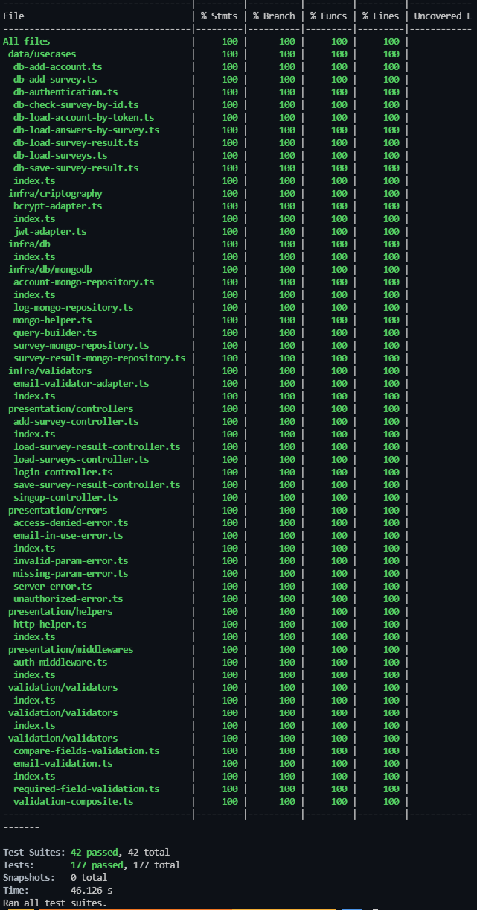

# ** API SOLID CLEAN ARCHITECTURE TDD DDD **

---

## Description
Essa API foi desenvolvida em conjuto com o professor Rodrigo Manguinho enquanto estudava seu curso - NodeJs, Typescript, TDD, DDD, Clean Architecture e SOLID - na Udemy.

O objetivo do treinamento é mostrar como criar uma API com uma arquitetura bem definida e desacoplada, utilizando TDD (programação orientada a testes) como metodologia de trabalho, Clean Architecture para fazer a distribuição de responsabilidades em camadas, sempre seguindo os princípios do SOLID e, sempre que possível, aplicando Design Patterns para resolver alguns problemas comuns.

---

### Result of Coverage using TDD

  

---
> ## APIs construídas no treinamento

1. [Cadastro](./requirements/signup.md)
2. [Login](./requirements/login.md)
3. [Criar enquete](./requirements/add-survey.md)
4. [Listar enquetes](./requirements/load-surveys.md)
5. [Responder enquete](./requirements/save-survey-result.md)
6. [Resultado da enquete](./requirements/load-survey-result.md)

> ## Princípios

* Single Responsibility Principle (SRP)
* Open Closed Principle (OCP)
* Liskov Substitution Principle (LSP)
* Interface Segregation Principle (ISP)
* Dependency Inversion Principle (DIP)
* Separation of Concerns (SOC)
* Don't Repeat Yourself (DRY)
* You Aren't Gonna Need It (YAGNI)
* Keep It Simple, Silly (KISS)
* Composition Over Inheritance
* Small Commits

> ## Design Patterns

* Factory
* Adapter
* Composite
* Decorator
* Proxy
* Dependency Injection
* Abstract Server
* Composition Root
* Builder
* Singleton

> ## Metodologias e Designs

* TDD
* Clean Architecture
* DDD
* Conventional Commits
* GitFlow
* Modular Design
* Dependency Diagrams
* Use Cases
* Continuous Integration
* Continuous Delivery
* Continuous Deployment

> ## Bibliotecas e Ferramentas

* NPM
* Typescript
* Git
* Docker
* Jest
* MongoDb
* Travis CI
* Swagger
* Bcrypt
* JsonWebToken
* Faker
* Coveralls
* Validator
* Express
* Apollo Server Express
* Graphql
* Graphql ISO Date
* Graphql Scalars
* Graphql Tools
* Supertest
* Husky
* Lint Staged
* Eslint
* Standard Javascript Style
* Sucrase
* Nodemon
* Rimraf
* In-Memory MongoDb Server
* MockDate
* Module-Alias
* Copyfiles
* Npm Check
* Bson ObjectId
> ## Features do Node

* Documentação de API com Swagger
* API Rest com Express
* GraphQL com Apollo Server
* Log de Erro
* Segurança (Hashing, Encryption e Encoding)
* CORS
* Middlewares
* Nível de Acesso nas Rotas (Admin, User e Anônimo)
* Dockerização do projeto com Docker

> ## Features do GraphQL

* Types
* Queries
* Mutations
* Resolvers
* Directives
* Scalars
* Plugins 
* Error Handling

> ## Features do Git

* Alias
* Log Personalizado
* Branch
* Reset
* Amend
* Tag
* Stash
* Rebase
* Merge

> ## Features do Typescript

* POO Avançado
* Interface
* TypeAlias
* Namespace
* Utility Types
* Modularização de Paths
* Configurações
* Build
* Deploy
* Uso de Breakpoints

> ## Features de Testes

* Testes Unitários
* Testes de Integração (API Rest & GraphQL)
* Cobertura de Testes
* Test Doubles
* Mocks
* Stubs
* Spies
* Fakes

> ## Features do MongoDb

* Connect e Reconnect
* Collections
* InsertOne e InserMany
* Find, FindOne e FindOneAndUpdate
* DeleteMany
* UpdateOne
* Aggregation (Match, Group, Unwind, Lookup, AddFields, Project, Sort)
* ObjectId
* Upsert e ReturnOriginal
* Push, Divide, Multiply, ArrayElemAt, Cond, Sum
* Filter, Map, Reduce, MergeObjects, ConcatArrays

> ## Features do Docker

* Docker compose
* Criação de container para o MongoDb
* Criação de continer pra API
* Portas, Volumes, Images